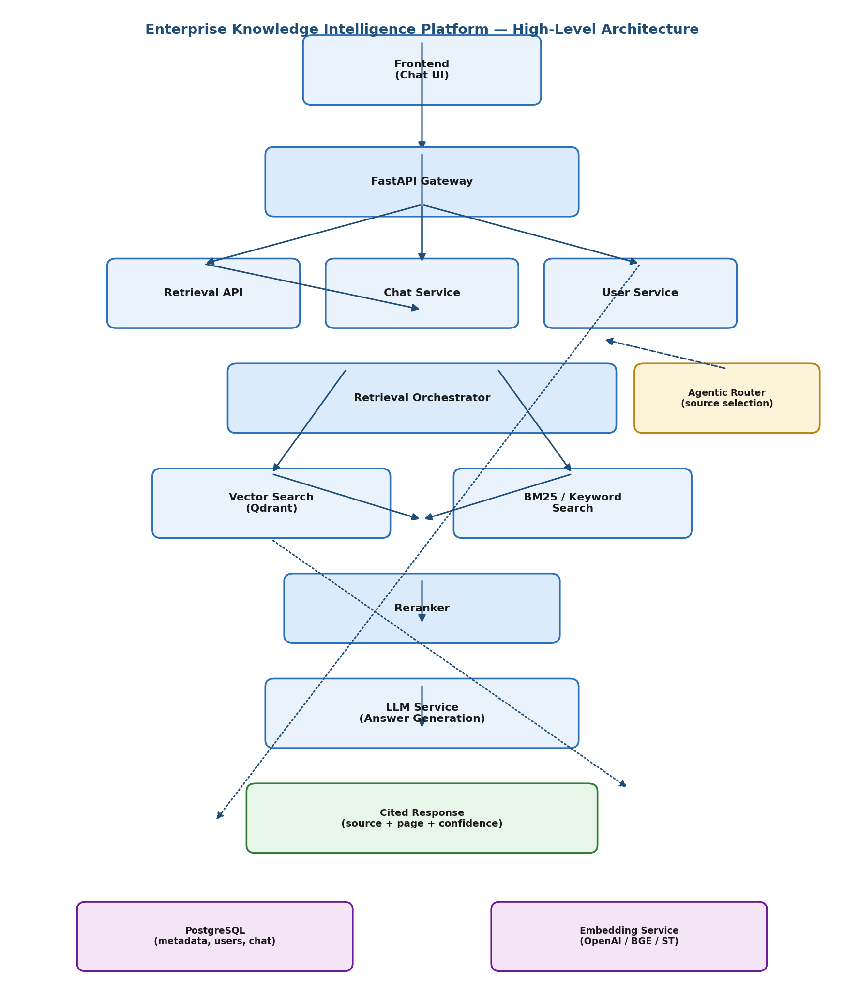

# Enterprise Knowledge Intelligence Platform (EKIP)

An Agentic Retrieval-Augmented Generation (RAG) platform that ingests enterprise knowledge
(PDFs, API specs, technical docs, wikis, Jira, GitHub) and answers natural-language questions
with citation-backed, explainable responses through a conversational interface.

> **Status:** 🚧 Foundation stage (PR #1). Core services land in subsequent PRs — see
> [`docs/project_roadmap.md`](docs/project_roadmap.md).

## Why this project

Employees waste time hunting for answers across disconnected tools. Keyword search doesn't
understand context. EKIP retrieves relevant knowledge via hybrid (vector + keyword) search,
reranks it, and generates grounded, cited answers — with an agentic router deciding which
knowledge source to query.

## Architecture



See also:
- [`docs/architecture/sequence_diagram.png`](docs/architecture/sequence_diagram.png) — request flow for a chat query
- [`docs/architecture/database_schema.png`](docs/architecture/database_schema.png) — core tables

## Tech Stack

| Layer | Tech |
|---|---|
| API | FastAPI |
| Orchestration | Apache Airflow |
| Metadata / relational store | PostgreSQL |
| Vector store | Qdrant |
| Embeddings | OpenAI / BGE / Sentence-Transformers |
| LLM | Claude / GPT / open-source LLMs |
| Containerization | Docker, Docker Compose |

## Repository Structure

```
enterprise-rag-platform/
│
├── docs/
│   ├── architecture/
│   │   ├── high_level_architecture.png
│   │   ├── sequence_diagram.png
│   │   └── database_schema.png
│   ├── requirements.md        # functional & non-functional requirements
│   ├── api_spec.md            # planned API contract (implemented incrementally)
│   └── project_roadmap.md     # phase-by-phase roadmap mapped to PRs
│
├── airflow/                    # DAGs for scheduled ingestion (PR #5)
├── backend/                    # FastAPI app: retrieval, chat, user services (PR #2+)
├── frontend/                   # Chat UI (later PR)
├── tests/                      # Unit / integration tests
├── docker/
│   ├── Dockerfile.backend
│   └── docker-compose.yml
├── requirements.txt
├── .env.example
├── .gitignore
├── LICENSE
└── README.md
```

## Getting Started (infra only — for now)

This PR only stands up the foundation: Postgres + Qdrant via Docker Compose. The FastAPI
app itself is added in PR #2.

```bash
git clone <your-repo-url>
cd enterprise-rag-platform
cp .env.example .env        # fill in secrets

docker compose -f docker/docker-compose.yml up -d
```

This brings up:
- **PostgreSQL** on `localhost:5432`
- **Qdrant** on `localhost:6333` (REST) / `6334` (gRPC)

## Roadmap

| PR | Phase | Focus |
|----|-------|-------|
| #1 | Foundation | Repo, docs, diagrams, Docker skeleton *(this PR)* |
| #2 | Basic RAG | PDF upload, chunking, embeddings, vector search |
| #3 | Advanced Retrieval | Hybrid search, metadata filters, citation engine |
| #4 | Conversational RAG | Chat history, memory, sessions |
| #5 | Airflow Integration | Automated ingestion, retries |
| #6 | Agentic RAG | Query router, multi-source retrieval |
| #7 | Evaluation Framework | Hallucination detection, faithfulness/retrieval metrics |
| #8 | Production Readiness | Auth, RBAC, monitoring, logging, CI/CD |

Full detail in [`docs/project_roadmap.md`](docs/project_roadmap.md).

## License

[MIT](LICENSE)
